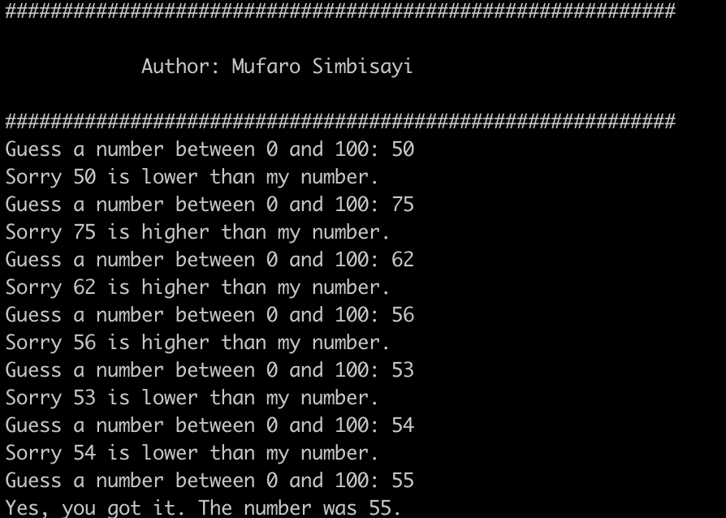

# App 2: Guess my number game

Key concepts showcased
=================

**String formatting**

`"Your number was {}.".format(num)`

**Conditionals**

    if TEST:
        conditional code
        conditional code
    elif TEST:
        conditional code
    else:
        conditional code
        
**Loops**

    while TEST:
        loop code
        loop code
        loop code

**importing modules**

    import os
    print(os.sys.version)
    
**random numbers**

Random numbers are generated using the `randint()` method in the random module.
