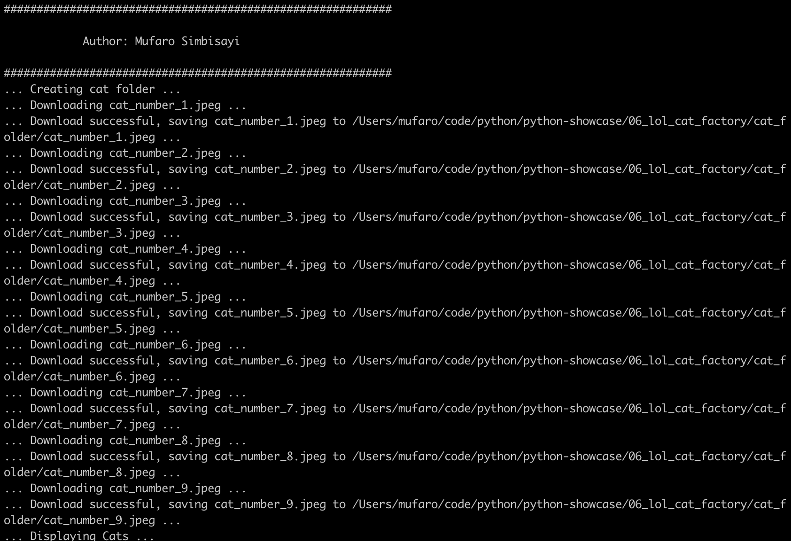

# App 6: LOLCat Factory App

Key concepts showcased
=================

**Random LOLCat web service**

[consuming-python-services-api.azurewebsites.net/cats/random](http://consuming-python-services-api.azurewebsites.net/cats/random)

**Binary data from requests**

    response = requests.get(url, stream=True)
    return response.raw

**Write binary data from one stream to a file**

    with open(file_name, 'wb') as fout:
        shutil.copyfileobj(data, fout)

**Displaying cats to the user**

    # OS X
    subprocess.call(['open', folder])
    
    # Windows
    subprocess.call(['explorer', folder])
    
    # Linux
    subprocess.call(['xdg-open', folder])
